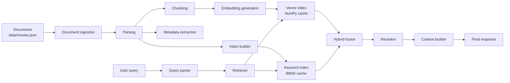
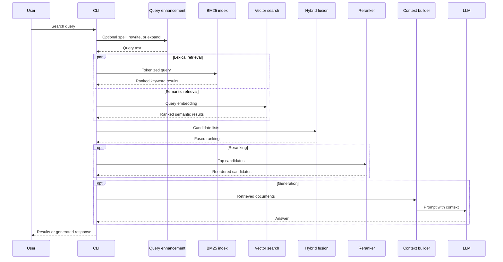

# RAG Search Engine

A local retrieval-augmented search engine for hybrid movie search.

Keyword search is reliable when users know exact terms, but it breaks down on vague intent, synonyms, paraphrases, and natural-language descriptions. Dense vector search handles meaning better, but it can miss exact names, rare tokens, and lexical constraints. This project combines BM25, sentence-transformer embeddings, chunk-level retrieval, rank fusion, optional reranking, and generation workflows into a small Python codebase that is easy to inspect, run, and extend.

---

## Features

- **Hybrid retrieval:** BM25 and dense semantic retrieval with weighted fusion or reciprocal rank fusion (RRF).
- **Dense vector search:** SentenceTransformer embeddings with cosine similarity over movie descriptions.
- **BM25:** Inverted index with stemming, stopword filtering, term frequency, IDF, and BM25 scoring.
- **Semantic search:** Natural-language queries over full documents or semantically chunked passages.
- **Chunking:** Fixed-size word chunks and sentence-based chunks with configurable overlap.
- **Embeddings:** Local embedding generation with `all-MiniLM-L6-v2` by default.
- **Fast local indexing:** Cached keyword indexes and embedding matrices under `cache/`.
- **Reranking:** Optional LLM-based individual or batch reranking, plus cross-encoder reranking.
- **Streaming ingestion:** Not implemented yet; planned for incremental document updates.
- **Metadata filtering:** Result metadata is supported in the shared result format;
- **CLI:** Separate commands for keyword search, semantic search, hybrid search, evaluation, multimodal search, and RAG generation.

---

## Architecture



| Component | Responsibility | Implementation |
| --- | --- | --- |
| Document ingestion | Loads the source corpus into memory. | `load_movies()` reads `data/movies.json`. |
| Parsing | Converts each record into searchable text. | Movie title and description are combined for indexing. |
| Chunking | Splits long text into fixed-size or sentence-based passages. | `fixed_sized_chunking()` and `semantic_chunking()`. |
| Embedding generation | Encodes documents, chunks, and queries into dense vectors. | `SentenceTransformer("all-MiniLM-L6-v2")`. |
| Metadata extraction | Preserves document IDs, titles, chunk IDs, and scores. | Shared result dictionaries and chunk metadata cache. |
| Index builder | Builds local caches for keyword and vector retrieval. | Pickle files for BM25, `.npy` files for embeddings. |
| Vector database | Stores dense vectors for cosine-similarity search. | Local NumPy arrays; replaceable with a vector database. |
| Keyword index | Stores postings, term frequencies, document lengths, and document map. | `InvertedIndex` with BM25 scoring. |
| Query parser | Normalizes user queries for the selected retriever. | Tokenization for BM25; raw text for semantic search. |
| Retriever | Executes keyword and semantic retrieval. | `InvertedIndex.bm25_search()` and `SemanticSearch.search()`. |
| Hybrid fusion | Combines lexical and semantic candidates. | Weighted score fusion or reciprocal rank fusion. |
| Reranker | Reorders candidate results using a stronger relevance model. | LLM individual/batch reranking or cross-encoder scoring. |
| Context builder | Formats retrieved documents for generation. | RAG, summarization, and citation prompts. |
| Final response | Returns ranked documents or an LLM-generated answer. | CLI output from search and generation commands. |

---

## Search Pipeline



---

## Indexing Pipeline

Documents become searchable in two parallel indexes:

1. **Load corpus:** Read `data/movies.json` into a list of movie records.
2. **Build keyword index:** Lowercase text, remove punctuation, remove stopwords, stem tokens, and store postings plus term statistics.
3. **Build document embeddings:** Encode `title: description` strings with the embedding model and write the matrix to `cache/movie_embeddings.npy`.
4. **Build chunk embeddings:** Split descriptions into sentence chunks, embed each chunk, and write vectors plus chunk metadata to `cache/`.
5. **Reuse caches:** On later runs, cached indexes are loaded when their expected files are present.

Generated files are intentionally ignored by Git because they depend on the local model/runtime and can be rebuilt.

---

## Installation

### Prerequisites

| Requirement | Notes |
| --- | --- |
| Python | `>=3.14` as declared in `pyproject.toml`. |
| uv | Recommended for dependency resolution and command execution. |
| Disk space | Required for the virtual environment, sentence-transformer model cache, and generated indexes. |
| OpenRouter API key | Optional; required only for query enhancement, LLM reranking, evaluation, and RAG generation. |

### Build

```bash
git clone https://github.com/phraakture/rag-search-engine.git
cd rag-search-engine
uv sync
```

### Run

```bash
uv run cli/keyword_search_cli.py build
uv run cli/semantic_search_cli.py embed_chunks
uv run cli/hybrid_search_cli.py rrf_search "bear adventure movie" --limit 5
```

### Configuration

Create a `.env` file only if you use LLM-backed features:

```bash
OPENROUTER_API_KEY=your_api_key_here
```

---

## Quick Start

Run a complete local hybrid search from a clean checkout:

```bash
uv sync
uv run cli/keyword_search_cli.py build
uv run cli/semantic_search_cli.py embed_chunks
uv run cli/hybrid_search_cli.py rrf_search "animated bear in london" --limit 5 --debug
```

Example output shape:

```text
Reciprocal Rank Fusion Results for 'animated bear in london' (k=60):

1. Paddington
   RRF Score: 0.032
   BM25 Rank: 1, Semantic Rank: 1
   A young Peruvian bear travels to London...
```

---

## Configuration

| Option | Default | Where | Description |
| --- | ---: | --- | --- |
| `DEFAULT_SEARCH_LIMIT` | `5` | `cli/lib/search_utils.py` | Number of results returned by most commands. |
| `DEFAULT_ALPHA` | `0.5` | `cli/lib/search_utils.py` | BM25 weight for weighted hybrid search. Semantic weight is `1 - alpha`. |
| `RRF_K` | `60` | `cli/lib/search_utils.py` | Reciprocal rank fusion constant. Higher values reduce the impact of top ranks. |
| `BM25_K1` | `1.5` | `cli/lib/search_utils.py` | BM25 term-frequency saturation parameter. |
| `BM25_B` | `0.75` | `cli/lib/search_utils.py` | BM25 document-length normalization parameter. |
| `DEFAULT_CHUNK_SIZE` | `200` | `cli/lib/search_utils.py` | Word count for fixed-size chunks. |
| `DEFAULT_CHUNK_OVERLAP` | `1` | `cli/lib/search_utils.py` | Word overlap for fixed-size chunks. |
| `DEFAULT_SEMANTIC_CHUNK_SIZE` | `4` | `cli/lib/search_utils.py` | Maximum number of sentences per semantic chunk. |
| `DATA_PATH` | `data/movies.json` | `cli/lib/search_utils.py` | Source corpus path. |
| `STOPWORDS_PATH` | `data/stopwords.txt` | `cli/lib/search_utils.py` | Stopword list used by BM25 tokenization. |
| `CACHE_DIR` | `cache/` | `cli/lib/search_utils.py` | Directory for generated indexes and embeddings. |
| `OPENROUTER_API_KEY` | unset | environment | API key for LLM-backed features. |

---

### Keyword search

Build the inverted index:

```bash
uv run cli/keyword_search_cli.py build
```

Run BM25 search:

```bash
uv run cli/keyword_search_cli.py bm25search "space adventure"
```

Response:

```text
Searching for: space adventure
1. (42) Example Movie - Score: 3.14
```

Inspect scoring internals:

```bash
uv run cli/keyword_search_cli.py tf 1 bear
uv run cli/keyword_search_cli.py idf bear
uv run cli/keyword_search_cli.py tfidf 1 bear
uv run cli/keyword_search_cli.py bm25idf bear
uv run cli/keyword_search_cli.py bm25tf 1 bear
```

### Semantic search

Verify the embedding model:

```bash
uv run cli/semantic_search_cli.py verify
```

Embed text:

```bash
uv run cli/semantic_search_cli.py embed_text "a bear travels to london"
```

Search full documents:

```bash
uv run cli/semantic_search_cli.py search "a family movie about a bear" --limit 5
```

Build and search chunks:

```bash
uv run cli/semantic_search_cli.py embed_chunks
uv run cli/semantic_search_cli.py search_chunked "bear in london" --limit 5
```

Chunk text:

```bash
uv run cli/semantic_search_cli.py semantic_chunk "Sentence one. Sentence two. Sentence three." --max-chunk-size 2 --overlap 1
```

### Hybrid search

Weighted fusion:

```bash
uv run cli/hybrid_search_cli.py weighted_search "bear adventure" --alpha 0.5 --limit 5
```

Reciprocal rank fusion:

```bash
uv run cli/hybrid_search_cli.py rrf_search "bear adventure" -k 60 --limit 5
```

Query enhancement and reranking:

```bash
uv run cli/hybrid_search_cli.py rrf_search "that bear movie where leo gets attacked" --enhance rewrite --rerank-method cross_encoder --limit 5
```

Evaluation with an LLM judge:

```bash
uv run cli/hybrid_search_cli.py rrf_search "bear adventure" --evaluate --limit 5
```

### Retrieval-augmented generation

These commands require `OPENROUTER_API_KEY`.

Generate an answer from retrieved documents:

```bash
uv run cli/augmented_generation_cli.py rag "what should I watch if I want a bear movie?"
```

Summarize search results:

```bash
uv run cli/augmented_generation_cli.py summarize "family bear movies" --limit 5
```

Answer with citations:

```bash
uv run cli/augmented_generation_cli.py citations "family bear movies" --limit 5
```

### Evaluation

Evaluate hybrid search against `data/golden_dataset.json`:

```bash
uv run cli/evaluation_cli.py --limit 5
```

Response:

```text
k=5

- Query: example query
  - Precision@5: 0.4000
  - Recall@5: 0.6667
  - F1 Score: 0.5000
```

---

## Benchmarks

Benchmarks are not published yet. Use this table format when reporting measurements.

| Workload | Dataset | Hardware | Metric | Result |
| --- | --- | --- | --- | --- |
| Keyword indexing | `data/movies.json` | TBD | documents/sec | TBD |
| Embedding generation | `data/movies.json` | TBD | documents/sec | TBD |
| Chunk embedding generation | `data/movies.json` | TBD | chunks/sec | TBD |
| BM25 search | `data/movies.json` | TBD | p50 / p95 latency | TBD |
| Semantic search | `data/movies.json` | TBD | p50 / p95 latency | TBD |
| Hybrid RRF search | `data/movies.json` | TBD | p50 / p95 latency | TBD |
| Cross-encoder reranking | top-k candidates | TBD | candidates/sec | TBD |
| Memory usage | all indexes loaded | TBD | RSS | TBD |
| Throughput | concurrent searches | TBD | queries/sec | TBD |

Suggested local benchmark command:

```bash
python -m timeit -s 'from cli.lib.hybrid_search import HybridSearch; from cli.lib.search_utils import load_movies; hs=HybridSearch(load_movies())' 'hs.rrf_search("bear adventure", 60, 5)'
```

---

## Project Layout

```text
rag-search-engine/
├── README.md                         # Project overview and operating guide
├── pyproject.toml                    # Python package metadata and dependencies
├── uv.lock                           # Locked dependency graph
├── pyrightconfig.json                # Type-checker configuration
├── test_llm.py                       # LLM integration smoke test
├── data/
│   ├── movies.json                   # Source movie corpus
│   ├── golden_dataset.json           # Evaluation queries and relevant documents
│   ├── stopwords.txt                 # Keyword-search stopwords
│   └── paddington.jpeg               # Sample image for multimodal experiments
└── cli/
    ├── keyword_search_cli.py         # BM25 and inverted-index commands
    ├── semantic_search_cli.py        # Embedding, chunking, and semantic search commands
    ├── hybrid_search_cli.py          # Weighted and RRF hybrid search commands
    ├── augmented_generation_cli.py   # RAG answer, summary, and citation commands
    ├── evaluation_cli.py             # Precision, recall, and F1 evaluation
    ├── multimodal_search_cli.py      # Multimodal search entry point
    ├── describe_image_cli.py         # Image description entry point
    └── lib/
        ├── search_utils.py           # Shared constants, paths, types, and loaders
        ├── keyword_search.py         # Tokenization, inverted index, TF-IDF, and BM25
        ├── semantic_search.py        # Embeddings, cosine similarity, and chunk search
        ├── hybrid_search.py          # Score normalization, weighted fusion, and RRF
        ├── llm.py                    # Query enhancement, reranking, evaluation, and LLM calls
        └── multimodal_search.py      # Image/text search helpers
```

`cache/` is created at runtime and stores generated indexes and embeddings. It is not committed.

---

## Roadmap

- [x] Keyword inverted index
- [x] BM25 scoring
- [x] Fixed-size chunking
- [x] Sentence-based semantic chunking
- [x] Dense document embeddings
- [x] Dense chunk search
- [x] Hybrid weighted retrieval
- [x] Reciprocal rank fusion
- [x] Query enhancement
- [x] LLM and cross-encoder reranking
- [x] Offline evaluation dataset
- [ ] REST API
- [ ] Persistent vector database backend
- [ ] Dockerize

---

## License

MIT
